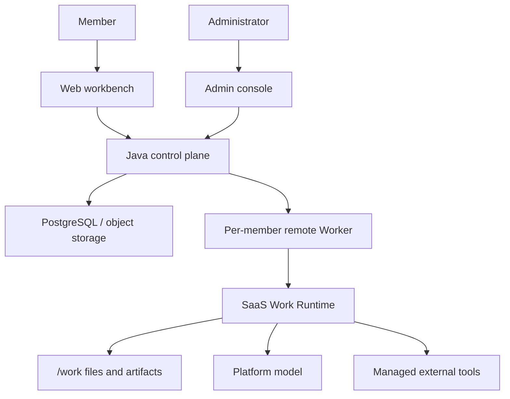

# Kross

**English** | [简体中文](README.zh-CN.md)

[](https://github.com/zzc-101/krosswork/actions/workflows/ci.yml)
[](LICENSE)

Kross is a self-hosted **cloud computer agent** for organizations.

Each member gets a remote computer: a long-lived workspace, an isolated Worker, and their own files and memory. Members describe the work in a browser. The agent organizes material and writes artifacts on that remote machine. Closing a laptop does not stop the job. Kross does not operate the user's personal computer.

It sits in the same category as ChatGPT Work, Grok Bot, and Cursor Cloud Agent. The difference is that the computer runs on your Docker host or k3s cluster, and organization controls ship in the product instead of a paid enterprise tier.

## Who it is for

- Teams that want the agent on their own infrastructure, not a vendor-held workspace.
- Organizations that need multiple tenants, roles, enterprise login, and per-person isolation rather than one shared machine.
- Knowledge work that produces briefs, plans, tables, and notes — not repository edits and pull requests.

Kross is a Web product. It does not ship a terminal UI, a local CLI, or a coding-agent mode.

## Included

- **One computer per member**: an independent Worker and durable `/work`, not a session on a shared disk.
- **Tenants and roles**: platform super admin, organization admin, and members, with data scoped by organization.
- **Enterprise login**: the control plane verifies an OIDC identity provider; model and SSO secrets are encrypted at rest.
- **Platform-managed models and Skills**: members do not paste API keys, pick execution modes, or choose permission profiles.
- **Confirm only the outside world**: workspace reads and writes run without prompts; access to external systems requires a clear confirmation.
- **Two deployments**: Docker Compose on one host, or k3s with Helm, where each Worker is its own Pod.

## Quick start

Requirements: Docker Engine and Docker Compose v2.

```bash
./scripts/start-cloud.sh
```

- Workbench: `http://localhost:8787`
- Administration: `http://localhost:8787/admin/`

The first registered account becomes the platform super administrator. Enable a model, create an organization, and onboard members before normal work.

```bash
./scripts/start-cloud.sh --no-build
./scripts/start-cloud.sh --logs
./scripts/start-cloud.sh --stop
```

Public deployments need TLS in front of the Web entry. On a single host, only the control plane may access the Docker Socket. In a cluster, the control plane starts Worker Pods through the Kubernetes API and does not mount the Docker Socket. See [deployment and operations](docs/cloud-agent-deployment.md).

Cluster install:

```bash
helm upgrade --install kross deploy/cluster -n kross --create-namespace
```

## Using Kross

Describe the desired result directly:

```text
Read the files in my workspace, summarize the customer feedback, and create an action-plan document.
```

The workbench provides conversations, installed Skills, personal memory, and generated files. Results are artifacts, evidence, and incomplete items. A confirmation appears only before a managed tool accesses or modifies an external system.

## Architecture

The browser talks only to the control plane. The control plane owns identity, organizations, conversations, model credentials, Skill versions, streaming, and Worker lifecycle. Each member's Worker owns the agent loop and `/work`.



- Conversations live in PostgreSQL; user files live in object storage, with an Agent working copy under `/work`.
- Preferences and facts sync into `USER.md` and `MEMORY.md`.
- The browser sends HTTP and receives SSE. The Worker keeps a WebSocket only behind the control plane.

## Repository layout

- `frontend/web`: member workbench.
- `frontend/admin-web`: platform and organization administration.
- `backend`: Spring Boot control plane.
- `worker`: Node.js container runtime; Agent Core is under `worker/core`.
- `deploy/local`: Docker Compose and images for a single host.
- `deploy/cluster`: Helm chart for k3s.
- `docs`: operations, architecture, protocol, and security guides.

## Development

Source-development baselines are Node.js `>= 22.19.0`, Java 21, and pnpm `10.14`.

```bash
cd frontend && pnpm typecheck && pnpm test && pnpm build
cd worker && pnpm typecheck && pnpm test && pnpm build
cd backend && ./mvnw test
node scripts/check-version-consistency.mjs
node scripts/check-doc-links.mjs
```

The repository root is not a Node project. Install frontend and Worker dependencies separately.

## Documentation

- [Documentation index](docs/README.md)
- [Getting started](docs/getting-started.md)
- [Configuration](docs/configuration.md)
- [Technical overview](docs/technical-overview.md)
- [Security model](docs/security.md)
- [Cloud protocol](docs/cloud-protocol.md)
- [Troubleshooting](docs/troubleshooting.md)
- [Contributing](CONTRIBUTING.md)
- [Security policy](SECURITY.md)
