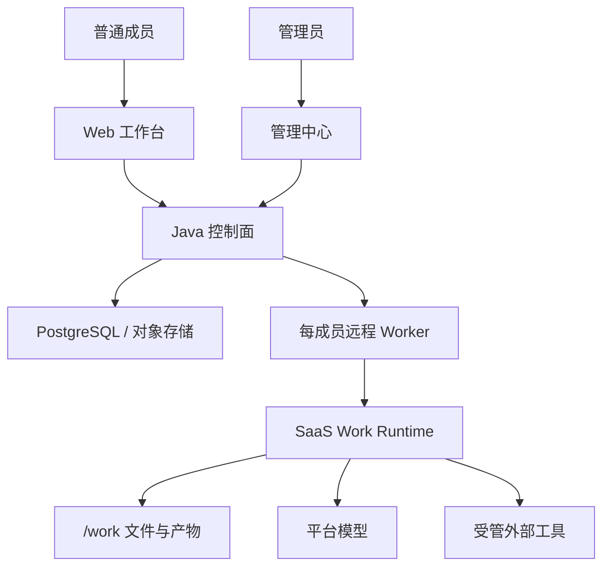

# Kross

[English](README.md) | **简体中文**

[](https://github.com/zzc-101/krosswork/actions/workflows/ci.yml)
[](LICENSE)

Kross 是组织可自托管的**云端电脑 Agent**。

每位成员有一台远程电脑：长期工作区、独立 Worker、自己的文件和记忆。成员用浏览器描述要完成的工作，Agent 在远端整理资料、写出产物。合上笔记本，任务还在跑。它不操作用户自己的电脑。

和 ChatGPT Work、Grok Bot、Cursor Cloud Agent 同一类，区别是电脑跑在你自己的 Docker 或 k3s 上，组织治理开箱即有，不必再买一层企业版。

## 适合谁

- 团队要把 Agent 放进自己的基础设施，而不是把工作区交给模型厂商。
- 需要多组织、角色、企业登录和按人隔离，而不是一台共享电脑给所有人用。
- 要的是摘要、方案、表格、纪要这类工作产物，不是改仓库、提 PR。

Kross 是 Web 产品。不提供终端 UI、本地 CLI，也不是编程 Agent。

## 开箱即有

- **一人一机**：每位成员独立 Worker 和持久 `/work`，不是共享磁盘上的会话。
- **多租户与角色**：平台超级管理员、组织管理员、普通成员；数据按组织切开。
- **企业登录**：控制面验证 OIDC IdP；模型密钥和 SSO 密钥加密存放。
- **平台管模型与 Skill**：成员不填 API Key、不选运行模式、不配权限档位。
- **外部才确认**：工作区读写自动进行；访问或修改外部系统前明确确认。
- **两种部署**：单机 Docker Compose；集群用 k3s Helm，Worker 是独立 Pod。

## 快速开始

需要 Docker Engine 和 Docker Compose v2：

```bash
./scripts/start-cloud.sh
```

- 工作台：`http://localhost:8787`
- 管理中心：`http://localhost:8787/admin/`

第一个注册账号成为平台超级管理员。先启用模型、创建组织、邀请成员，再开始工作。

```bash
./scripts/start-cloud.sh --no-build
./scripts/start-cloud.sh --logs
./scripts/start-cloud.sh --stop
```

公网部署必须在 Web 入口前配置 TLS。单机只有控制面可以访问 Docker Socket；集群由控制面调 Kubernetes API 起 Pod，不挂 Docker Socket。细节见[部署与运维](docs/cloud-agent-deployment.md)。

集群安装：

```bash
helm upgrade --install kross deploy/cluster -n kross --create-namespace
```

## 使用方式

直接描述期望结果：

```text
读取工作区里的客户反馈，提炼主要问题，并生成一份下一步行动文档。
```

工作台提供对话、已安装 Skill、个人记忆、文件与产物。结果以产物、证据和未完成项表达。只有受管工具将访问或修改外部系统时，才会出现确认面板。

## 架构

浏览器只连控制面。控制面负责身份、组织、对话、模型凭证、Skill 版本、直播和 Worker 生命周期；每位成员的 Worker 负责 Agent 闭环和 `/work`。



- 对话在 PostgreSQL，文件在 `/work`（单机 volume，集群 JuiceFS）。
- 偏好与事实写入 `USER.md` 和 `MEMORY.md`。
- 浏览器 HTTP 发消息、SSE 收直播；Worker 只在控制面后保持 WebSocket。

## 目录

- `frontend/web`：普通成员工作台。
- `frontend/admin-web`：平台与组织管理中心。
- `backend`：Spring Boot 控制面。
- `worker`：Node.js 容器运行时，Agent Core 位于 `worker/core`。
- `deploy/local`：单机 Docker Compose 与镜像。
- `deploy/cluster`：k3s Helm chart。
- `docs`：运维、架构、协议与安全文档。

## 开发

源码开发基线为 Node.js `>= 22.19.0`、Java 21 与 pnpm `10.14`。

```bash
cd frontend && pnpm typecheck && pnpm test && pnpm build
cd worker && pnpm typecheck && pnpm test && pnpm build
cd backend && ./mvnw test
node scripts/check-version-consistency.mjs
node scripts/check-doc-links.mjs
```

根目录不是 Node 项目，前端与 Worker 分别安装依赖。

## 文档

- [介绍页](https://zzc-101.github.io/krosswork/)
- [文档索引](docs/README.md)
- [快速上手](docs/getting-started.md)
- [配置参考](docs/configuration.md)
- [技术概览](docs/technical-overview.md)
- [安全模型](docs/security.md)
- [Cloud Protocol](docs/cloud-protocol.md)
- [故障排查](docs/troubleshooting.md)
- [参与贡献](CONTRIBUTING.md)
- [安全政策](SECURITY.md)
