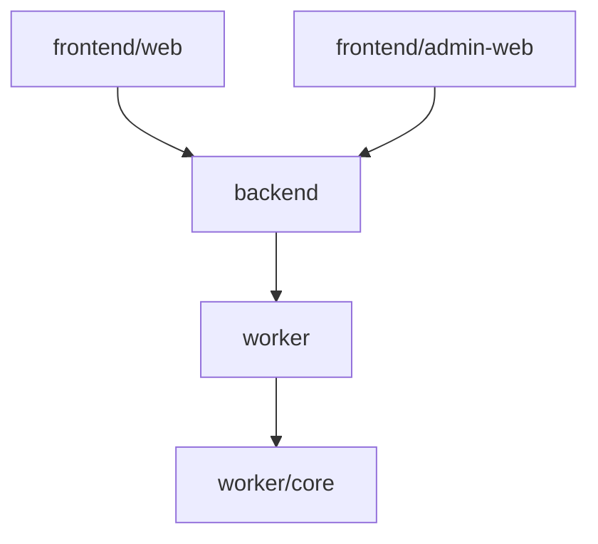
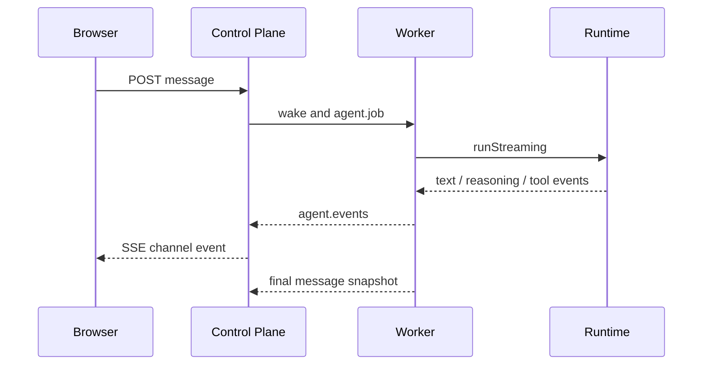

# Kross 技术概览

Kross 是面向组织的 SaaS Work Agent。控制面拥有身份与持久化，容器 Worker 拥有执行环境，浏览器只与控制面通信。

## 组件与依赖

| 组件 | 职责 |
|---|---|
| `frontend/web` | 对话、Skill、记忆、自动任务、文件与产物 |
| `frontend/admin-web` | 平台模型、组织、成员、Skill 包和基础设施管理 |
| `backend` | 身份、数据、SSE、Worker 租约与容器 / Pod 生命周期 |
| `worker` | 成员容器中的控制面协议适配与会话宿主 |
| `worker/core` | SaaS Runtime、上下文、工具、子任务与恢复 |
| `deploy/local` | 单机 Compose 与容器镜像 |
| `deploy/cluster` | k3s Helm chart（控制面可多副本 + JuiceFS CSI 工作区） |

依赖方向保持单向：Web 不引用 Core，Core 不依赖 Java 或 UI。

控制面使用 Redis 缓存热点读（每请求的身份校验、组织/成员鉴权、Worker token 认证、模型与 Skill 目录），Redis 故障时自动回源 PostgreSQL，TTL 即集群下的一致性边界。SSE 与 Worker job offer 经 Redis Pub/Sub 跨副本扇出，故障时降级为进程内投递。详见[配置参考](configuration.md#缓存层)。

## 唯一 Runtime

每个会话使用同一套自动工作闭环。Runtime 根据用户目标直接回答或调用工具，不读取用户选择的运行模式。用户要求“先给方案”只是普通语言约束，不生成特殊模式状态。

系统上下文由以下受管来源组成：

- SaaS Work Agent 基础行为；
- 控制面下发的 `USER.md` 与 `MEMORY.md`；
- 会话启动时固定的版本化 Skill；
- 当前 Todo 和实时工具边界。

其他 `/work` 文件是待处理资料，不会因为文件名而自动成为系统指令。

## 工具边界

默认内置工具只有：

- 文件：Read、Write、Edit、Delete、Move；
- 检索：Glob、Grep、Rg、List、Stat；
- 工作管理：TodoRead、TodoWrite；
- 受限子任务：Task。

Runtime 不注册 Shell、Git、Patch、后台进程或代码验证工具。Task 子任务最多一层，使用同一工作区和 Skill；调查子任务只读，执行子任务只额外获得 Write/Edit。

受管外部工具可以由平台连接，但仍通过 Tool Gateway。工作区 read/write 自动允许；network 和未知副作用要求确认。调度器只并发独立只读调用，写入与外部调用保持有序。

知识库是可选的受管 MCP 插件。平台开启知识库且知识服务就绪时，控制面在 Worker 设置中运行时合入 `knowledge` server（`transport: streamable-http`，`risk: read`），不写入 `AgentSettings`。Worker 用已持有的 `APP_AGENT_TOKEN` 调用控制面 `/mcp/knowledge`，只暴露 MCP 工具 `knowledge_search`（注册到 Tool Gateway 的名称为 `knowledge__knowledge_search`，只读免确认）；space 范围由控制面按组织解析，调用方不能指定任意 spaceId。关闭开关或知识服务不可用时，该条目不会下发，会话其余工具不受影响。ingest / publish 仍走管理端 REST，不作为 Agent 工具。

## 结果与恢复

最终结果包含：

- `artifacts`：创建或修改的工作产物；
- `evidence`：完成依据；
- `incompleteItems`：明确未完成部分。

完成门只要求产生真实用户回复，不把 Git 状态、测试或构建当作所有工作的通用成功条件。Stall Guard 会在重复调用无进展时先提示恢复，再有限停止。

等待外部工具确认时，Runtime 保存 open turn 和 checkpoint。恢复前重新核对 tool-call、已有结果、当前定义和实时策略；只有确定尚未执行的调用可以继续，任何已完成副作用都不会重放。

## Cloud 数据流

对话与最终 `parts` 在 PostgreSQL；Token delta 只做内存扇出。用户文件在对象存储；Agent 工作副本位于 `/work`。单机 `/work` 使用 Docker volume，多机使用 JuiceFS CSI。

## 当前边界

- Worker Core 仍是内部源码，不是稳定 SDK。
- 受管外部工具尚不支持所有交互式 OAuth 流程。
- 用户上传的文件先入对象存储，再同步到成员 `/work`。浏览器预签名上传；预览与下载走同源 `file/content`（cookie 鉴权后 302 到短时预签名）。单文件 10MB。文件面板可上传、下载、删除空目录；对话附件写入 `uploads/`。UTF-8 文本预览上限 256KB；png / jpeg / gif / webp 可内联；其余类型只下载。对话 `parts` 只存工作区路径。看图由 Worker 从工作区读成 base64。Agent 产物首次下载时从 `/work` 回写对象存储。
- 生产环境仍需在真实 TLS、弱网、移动端和备份恢复场景验收。
