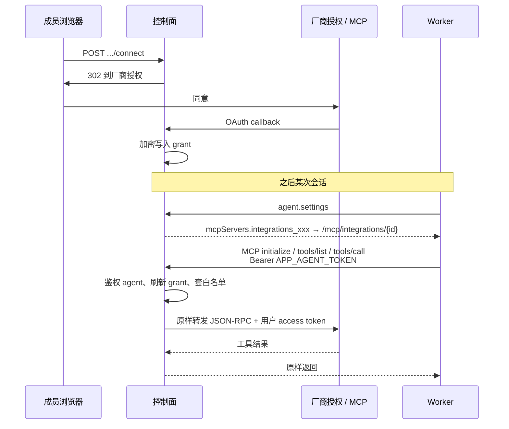

# 工作连接器

记录工作连接器的产品决定，以及后续继续接入时要复用的调研。Notion 与 GitLab 官方 MCP 已在仓库落地；飞书渠道和知识库 MCP 仍见 [技术概览](technical-overview.md)、[扩展 Kross](extensions.md)。

## 这次定下来的

- 工作台是交代和执行任务的主界面。
- 飞书、以及以后的 Telegram、企业微信，是辅助渠道：第二种交代任务的手段，也可以回投结果。渠道不是工作连接器。
- 真正要补的是**工作连接器**：Agent 用成员（或组织）的身份，去读、写外部办公系统。
- 产品面向一般办公，不做成程序员专属。GitLab 可以接，但不把第一批定义成「内网研发工具链」。
- 第一批：GitLab、Notion、邮件（一次多接若干厂商，国内外都要）。

飞书渠道仍走 `com.kross.connector`。工作连接器走 `com.kross.integration`：组织安装、成员 OAuth、控制面 MCP 代理。`credential_handles` 继续只服务平台模型。

## 权限怎么叠（厂商调研）

ChatGPT、Claude、Cursor、Glean、Linear 的做法接近：不在本产品里重做外部系统的组织和权限，而是叠三层闸。

1. **本产品开闸**：管理员决定这个组织有没有这个连接器、哪些角色能用。
2. **本产品限制动作**：只读、允许哪些写、新动作默不默认开、用之前问不问。
3. **对端授权**：成员（或 IdP）在对方系统完成授权；仓库、页面、邮箱、工单的 ACL 由对方裁定。Token 不能比这个人在对方系统里的权限更大。

工作区里启用某个连接器，并不等于能看到对方系统里的数据。ChatGPT 文档原话大意：使 app 对成员可用，不会授予已连接服务里的文件或操作权限。

身份常见三种，可以并存：

| 方式 | 谁授权 | 适用 |
|---|---|---|
| 个人 OAuth / 个人 Token | 每个成员自己连 | 邮件、Notion、多数 GitLab 操作 |
| 管理员登记实例 | 管理员填 host、OAuth 应用或租户 | 自建 GitLab、企业邮箱租户 |
| IdP 托管授权（Claude + Okta 一类） | 管理员授一次，成员登录继承 | 后期；现不做 |

组织级只做开闸和安装（批准应用、登记 GitLab 地址、登记邮箱租户）。这和「一把组织服务账号替所有人办事」不是一回事。服务账号留给对端没有个人身份的系统，而且要单独确认和审计。

参考（2026-09 查阅）：

- [ChatGPT Apps and connectors](https://learn.chatgpt.com/docs/enterprise/apps-and-connectors)
- [ChatGPT Slack app](https://help.openai.com/en/articles/12525822)
- [Connecting GitHub to ChatGPT](https://help.openai.com/en/articles/11145903)
- [Claude：组织级授权 MCP 连接器](https://support.claude.com/en/articles/15537633-authorize-mcp-connectors-for-your-entire-organization)
- [Cursor enterprise integrations](https://cursor.com/docs/enterprise/model-and-integration-management)
- [Linear MCP](https://linear.app/docs/mcp)
- [Glean GitHub connector](https://docs.glean.com/connectors/native/github/about)（搜索索引模型，代操作不要先学这条）

## 第一批

管理员登记连接，成员用自己的身份授权。动作先窄：检索和读取优先，写入走现有外部确认。默认工具边界不变：不因为接了 GitLab 就加回 Shell / Git / Patch。

### GitLab

自建和 gitlab.com 都要能连。管理员填实例地址；成员用 OAuth 或 Personal Access Token。权限继续听 GitLab 的项目/组 ACL。

先做：查 Merge Request、Issue、流水线状态，整理发布说明。先不做：代推代码、改仓库权限、改 CI 配置。

### Notion

官方 API / 官方 MCP。成员 OAuth 到自己的 Notion 工作区。页面和数据库权限听 Notion。

先做：按页检索、读正文、把工作区产物写成一页或写入指定数据库。先不做：工作区管理、成员管理。

### 邮件

一次覆盖多家，不要做成「只接一个网关品牌」。大厂走官方 API，其余走 IMAP/SMTP（能 OAuth2 就 OAuth2）。

成员连自己的邮箱。读、搜、写草稿、发信；发信必须确认。不要用组织公共服务账号群发。日历若跟同一套件（Graph / Google Calendar），可以顺带列进同一连接，但第一批以邮件正文为主。

**国际，优先官方 API**

| 厂商 | 接口 | 备注 |
|---|---|---|
| Microsoft 365 / Outlook | Microsoft Graph | 企业常要 Entra 管理员同意组织级权限 |
| Google Workspace / Gmail | Gmail API | 个人与 Workspace 授权路径不同 |
| 通用 IMAP/SMTP | IMAP + SMTP，优先 XOAUTH2 | 兜住没有专用 API 的厂商和自建邮局 |

**国内，能走 IMAP/SMTP 的先走协议，有开放平台的再补官方 API**

| 厂商 | 常见接入 | 备注 |
|---|---|---|
| 腾讯企业邮 | IMAP/SMTP；腾讯企业邮开放接口 | 国内企业很常见 |
| 网易企业邮 / 163 企业邮 | IMAP/SMTP | 协议即可起步 |
| 阿里邮箱 / 阿里企业邮箱 | IMAP/SMTP；阿里云邮件推送是另一条（偏发信服务） | 先按邮箱客户端协议接 |
| 飞书邮箱 | 飞书开放平台 | 和现有飞书渠道绑定分开，不要复用私聊 token 去读全员邮箱 |
| Coremail | IMAP/SMTP，现场常自建 | 政企、高校多 |
| 263 企业邮箱 | IMAP/SMTP | 传统企业邮 |
| 新浪企业邮箱 | IMAP/SMTP | 长尾 |

第一批实现顺序建议：Graph、Gmail、通用 IMAP/SMTP。国内品牌大多数可以先落在通用协议上，官方 API 当体验不够再补。

## 后续候选（未立项）

办公向，供以后挑。研发内网工具链（Jenkins、禅道、Harbor、Nexus）不作为默认下一波。

**办公套件**：Microsoft 365 其余件（日历、OneDrive、Word/Excel）、Google Calendar / Drive / Docs。

**国内协同（当工作系统，不只当渠道）**：飞书文档 / 知识库 / 日历 / 多维表格 / 审批；钉钉文档 / 审批 / 待办；企业微信日程 / 腾讯文档。

**文档与知识**：语雀、腾讯文档、金山文档 / WPS、石墨文档、Confluence。

**任务（非代码）**：飞书任务 / 飞书项目、钉钉待办、Asana、Monday.com、ClickUp、Trello。

**表格**：飞书多维表格、腾讯文档智能表格、Airtable、Google Sheets。

**CRM**：Salesforce、HubSpot、纷享销客、销售易、腾讯企点。现场字段定制多，若上线先只读。

**会议**：Zoom、腾讯会议；Teams / Meet 通常跟套件走。

**设计（非全员刚需）**：Figma。

暂不作为样板：用友 / 金蝶等 ERP，泛微 / 致远等 OA。办公里常见，但接口和流程各家一套。

## 和现有代码的关系

- 飞书私聊继续走 `com.kross.connector`（绑定、收件箱、`ConversationOutlet`）。新渠道（Telegram、企业微信）加适配器，不和工作连接器混表、混包。
- 知识库继续走 `/mcp/knowledge`，第一轮不迁进新目录。
- 工作连接器走**受管远程 MCP 目录 + 控制面代理**。不自造 `mail_search` 一类工具；厂商 `tools/list` 原样给 Worker。Worker / Tool Gateway / 默认文件工具集都不改结构。

## 架构设计

### 目标

组织启用、成员授权之后，Agent 能调用对方托管的 MCP。加 Notion、GitLab、Gmail 只加目录项和少量 OAuth 配置，不再改 `workerSettings` 的分支、不改 Worker、不改 Tool Gateway。

不在 Runtime 里注册自造工具。MCP 进 Tool Gateway 是现有 `connectAndRegisterMcpTools` 的行为，用的是厂商工具名。

### 不做什么

- Worker 内 `npx` / stdio 拉第三方 MCP。
- 普通用户粘贴 MCP URL、命令或密钥。
- 第一轮开放「任意 URL」自定义 MCP（和用户自配同质）。只允许平台预置条目。
- 把用户 access token 写入 Worker 环境或 `/work`。
- 给整段 server 标 `risk: read`（会盖掉所有工具的 annotation；现有 `inferMcpToolRisk` 如此）。
- 复用 `connector_bindings` / `credential_handles`。
- 第一轮接 IMAP / 国内企业邮（没有可用官方 MCP）。等厂商出 MCP，或以后单独托管一个 IMAP MCP。

### 总览

```text
工作台 / 管理端
    │ HTTP（登录 cookie）
    ▼
控制面  com.kross.integration
    │  目录 · 安装 · OAuth · grant · 动作白名单
    │  /mcp/integrations/{installationId}   ← Worker 用 APP_AGENT_TOKEN
    ▼
厂商托管 MCP
    Notion    https://mcp.notion.com/mcp
    GitLab    https://{host}/api/v4/mcp
    Gmail     https://gmailmcp.googleapis.com/mcp/v1
```

浏览器仍只跟控制面说话。Worker 只连控制面这条 MCP 代理，和知识库相同。厂商 token 不出控制面。



### 三层对象

| 层 | 谁写 | 含义 |
|---|---|---|
| `integration_catalog` | 平台预置（代码 seed，必要时超管补） | 一种可接的官方 MCP：固定 URL 模板、授权协议、展示名 |
| `integration_installations` | 组织管理员 | 本组织启用了哪一条；GitLab 在这里填 host；动作白名单在这里 |
| `integration_grants` | 成员本人 | 这个人完成了授权；加密 token、账号标签、过期时间 |

启用安装 ≠ 成员能用。没有 grant，`workerSettings` 不给这个人下发对应 server，`tools/list` 也不会出现。

### 预置目录（第一批）

代码里 `IntegrationPresets` 写死，Flyway 可再 seed 一行便于管理端展示。

| catalogId | 上游 URL | 授权 | 状态 |
|---|---|---|---|
| `notion` | `https://mcp.notion.com/mcp` | MCP OAuth（资源元数据 + PKCE） | 已做 |
| `gitlab` | `https://{host}/api/v4/mcp` | MCP OAuth / DCR；host 必填，默认 `gitlab.com` | 已做 |
| `gmail` | `https://gmailmcp.googleapis.com/mcp/v1` | Google OAuth（平台或组织的 client） | 未做 |

`gitlab.com` 与自建都走 `gitlab` 这一条，差别只是 `host`。

### 表（V30）

`integration_catalog` 可以不建表、只放代码常量。若要超管以后改 URL，再建表。第一轮代码常量即可。

```text
integration_installations
  id
  organization_id
  catalog_id          -- notion / gitlab / gmail
  status              -- active | disabled
  config_json         -- { "host": "gitlab.example.com" } 等非密钥
  secret_ciphertext   -- 可选：组织自带的 OAuth client secret
  action_policy_json  -- 见下
  created_by
  created_at, updated_at
  UNIQUE (organization_id, catalog_id)

integration_grants
  id
  installation_id
  user_id
  organization_id
  status              -- active | expired | revoked
  account_label       -- 邮箱或 Notion 工作区名，给 UI
  access_ciphertext
  refresh_ciphertext
  token_expires_at
  scopes
  created_at, updated_at
  UNIQUE (installation_id, user_id)

integration_oauth_states
  id                  -- state
  installation_id
  user_id
  organization_id
  code_verifier
  redirect_after
  expires_at
```

密钥一律走现有 `CredentialVault` 加密，不进日志、不进 Worker、不进 `/work`。

`action_policy_json`：

```json
{
  "tools": "allowlist",
  "allowed": ["search", "fetch", "create-pages"],
  "onNewTool": "disable"
}
```

`tools` 取值：`allowlist` | `all`。`onNewTool`：`disable`（默认）| `enable`。厂商新增工具不会自动出现。第一轮 Notion 给一份预置 allowlist，组织可改。

### 包与类（`com.kross.integration`）

不要放进 `com.kross.connector`。

```text
IntegrationPreset               预置 URL / 默认白名单
IntegrationService              安装、启用、断开、列表
IntegrationOAuthService         发现、PKCE、换票、刷新
IntegrationMcpService           JSON-RPC 转发 + 白名单 + workerSettings
IntegrationMcpController        POST /mcp/integrations/{installationId}
IntegrationMeController         /api/v2/me/integrations
AdminIntegrationController      /api/v2/admin/integrations（组织头 x-app-organization-id）
```

`AgentWorkerProtocolService.workerSettings` 只加一次：

```text
knowledgeMcp.managedServer()           // 保持
integrationMcp.managedServers(agent)   // 0..N，按该用户 active grant
```

`managedServers` 对每条 grant 产出：

```json
{
  "integrations_notion": {
    "transport": "streamable-http",
    "url": "{APP_PUBLIC_BASE_URL}/mcp/integrations/{installationId}",
    "authorization": { "type": "bearer-env", "env": "APP_AGENT_TOKEN" }
  }
}
```

不要设顶层 `risk`。读/写由厂商 annotation 决定；缺省按现有逻辑视为 `network`，走外部确认。

server id 用 `integrations_{catalogId}`，稳定，便于白名单和文档。同一组织同一 catalog 只有一条 installation。

### MCP 代理

`/mcp/**` 已是 `permitAll` + `IdentityFilter` 跳过，和知识库一样，在 handler 里用 `Authorization: Bearer` 对 agent token。

带 `id` 的 JSON-RPC 一律转发；`tools/list` 转发后按白名单过滤，`tools/call` 先过白名单。notification（无 id）先转发再返回 202，Worker 的 `notifications/initialized` 需要 202。

`tools/list`：转发上游后按 `action_policy` 过滤。  
`tools/call`：不在白名单则 `-32602`，不转发。  
上游 401：尝试 refresh 一次再重放；refresh 失败则把 grant 标 `expired`，返回可理解的错误，成员需重新连接。

代理是通用转发，**禁止**按 catalog 写 `if (notion)`。catalog 只影响：上游 URL 怎么拼、用哪套 OAuth 发现。

会话：厂商 MCP 可能要 `Mcp-Session-Id`。代理按 `(agentId, installationId)` 在控制面进程内存放 session，多副本时会话可能丢，Worker 已有的 session expired 重连（`McpSessionExpiredError`）可兜。第一轮接受这个；不要为此上 Redis。

### 授权

成员在工作台点「连接」，控制面当 MCP 客户端完成授权，**不是** Worker 弹 OAuth。现有 Worker 客户端只有 `bearer-env`，不会做 MCP OAuth。

通用步骤（Notion、GitLab 都走这条）：

1. 用 catalog 的资源 URL 做 RFC 9470 / 8414 发现。
2. 若对方支持 DCR（GitLab），为该 installation 注册客户端并保存；Notion 按官方客户端文档用 PKCE 公共客户端或平台登记的 client。
3. 发授权码 + PKCE，`state` 进 `integration_oauth_states`（短 TTL）。
4. callback 换票，写入 grant，跳回工作台。

Gmail 用 Google 常规 OAuth，不是 MCP 资源元数据；作为 `AuthProfile.GOOGLE_OAUTH` 插件。再加一家若也是「普通 OAuth + 固定 MCP URL」，只加一个 `AuthProfile`，不加新表。

自动任务：连接必须在创建任务之前完成。运行中途不弹登录。grant 过期则这次投递失败并留下可看的错误，不静默跳过授权。

### HTTP API

成员（`agent.read` 列表，`agent.chat` 连接/断开）：

- `GET /api/v2/me/integrations` — 本组织已安装条目 + 我的连接状态
- `POST /api/v2/me/integrations/{installationId}/connect` — 返回授权 URL
- `GET /api/v2/integrations/oauth/callback` — 公开，类似 SSO callback
- `DELETE /api/v2/me/integrations/{installationId}` — 撤销 grant

组织管理员（`ORGANIZATION_READ` 列表，`ORGANIZATION_UPDATE` 装/改/卸；组织头 `x-app-organization-id`）：

- `GET /api/v2/admin/integrations`
- `POST /api/v2/admin/integrations` `{ catalogId, tools?, host? }`
- `PATCH /api/v2/admin/integrations/{installationId}` 启用、停用、改工具策略或 `host`（改 host 会撤销已有授权）
- `DELETE /api/v2/admin/integrations/{installationId}` 卸载（级联 grant）

OAuth 回调：`{APP_EXTERNAL_BASE_URL}/api/v2/integrations/oauth/callback`。成功回工作台 `/?integration=connected`。

权限：列表与安装用现有组织管理能力，不新造角色。需要的话复用 `ORGANIZATION_UPDATE` 装、`AGENT_CHAT` 连。

工作台在飞书绑定旁边加「已连接的工作系统」，只显示组织已安装的。管理端加一页「工作连接器」。

### 风险与确认

| 来源 | 行为 |
|---|---|
| 厂商 `readOnlyHint: true` | 免确认（与知识库检索相同） |
| `destructiveHint` / `openWorldHint` / 无 annotation | 外部确认 |
| 不在白名单 | 工具不出现 |

前端文案继续用「访问或修改外部服务」，不展示原始工具 JSON。这是现有确认 UI，不改协议。

### 第一轮实现切面

1. V30 三张表 + `com.kross.integration` 骨架 + `workerSettings` 合入循环。
2. 代理：initialize / tools/list / tools/call + 白名单 + token refresh。
3. Notion 预置 + 组织启用（无 host）+ 成员 OAuth + 工作台连接状态。
4. 预置一份偏读的 Notion allowlist；写页须确认。
5. 管理端启用/停用；卸载撤销所有 grant。

验收：组织启用 Notion 后，成员未连接则会话里没有 Notion 工具；连接后能检索/读取自己有权的页面；白名单外的工具不出现；撤销后下一轮会话工具消失；跨组织 grant 不能互用。

### 下一轮起（不改结构）

- Gmail：同一套安装/代理；`AuthProfile.GOOGLE_OAUTH`；工具以官方 MCP 为准（预览期主要是搜、读、草稿）。
- 以后官方 MCP：`IntegrationPreset` 加一行。
- IMAP / 国内邮：我们自己托管一个 MCP，仍以 catalog 条目接入，不回到 REST 适配器。
- 知识库迁进目录：可选，删掉 `workerSettings` 里那行 `knowledgeMcp` 特判。

### Worker / 前端 / 协议

Worker Core、宿主、Cloud Protocol 帧形状不变。`agent.settings` 的 `mcpServers` 多若干受管条目，形态已有。

前端：工作台连接入口、管理端安装页、OAuth 回跳。不向普通用户展示 MCP URL 或 token。

## 明确不做

- 普通用户自配 MCP 命令、URL 或密钥。
- 因为接了 GitLab 就把默认工具加回 Shell / Git / Patch。
- 用组织服务账号冒充所有成员发信或改 Notion。
- 先做 Glean 那种全量索引爬虫；需要检索时当场调对端，或沿用现有知识库模块。
